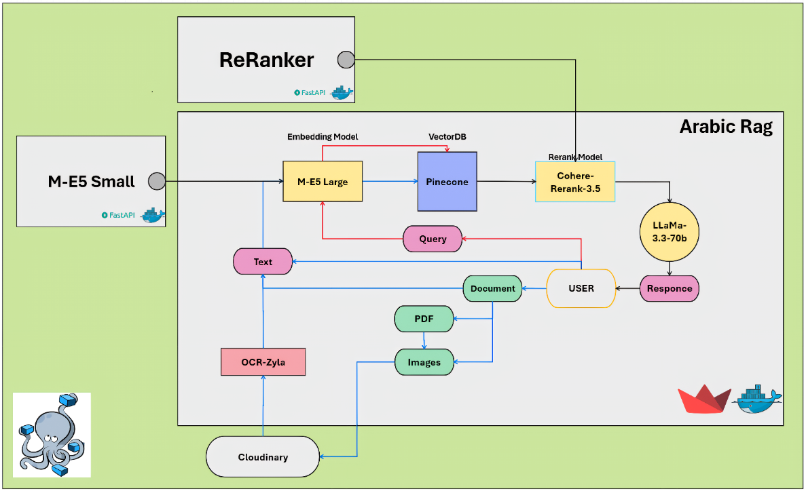
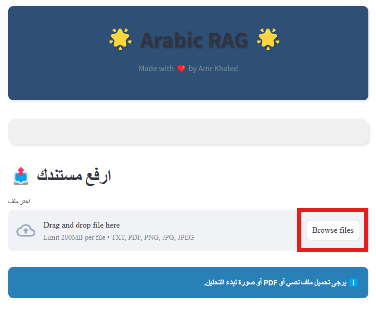
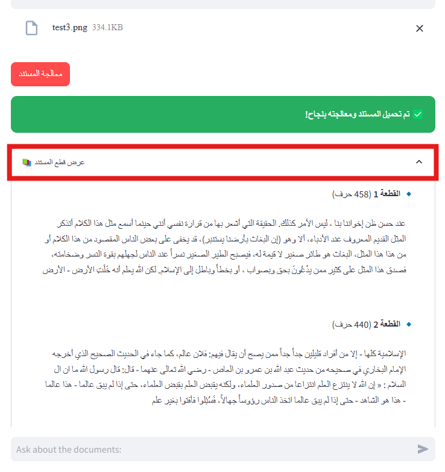
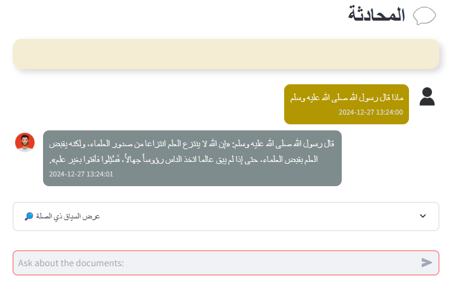
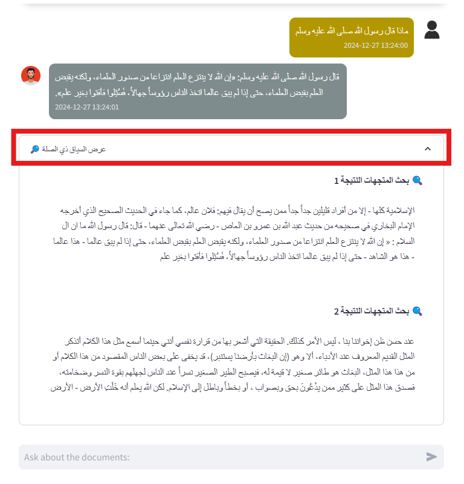

# Arabic-RAG 🚀

## Empowering Arabic Question Answering with Retrieval-Augmented Generation 📖

This project implements a sophisticated Retrieval-Augmented Generation (RAG) system specifically designed for processing and understanding Arabic text. It allows users to upload documents (.txt, .pdf, .png, .jpg, .jpeg) and ask questions about their content, leveraging advanced techniques for information retrieval and natural language generation to provide accurate and contextually relevant answers.

> 

## Description 📖

This project offers a comprehensive solution for building an Arabic question-answering system powered by Retrieval-Augmented Generation. It seamlessly integrates several key components to ingest, process, and understand Arabic documents, ultimately enabling users to interact with their data in a natural and intuitive way.

**Purpose and Goals:**

*   **Efficient Arabic Document Understanding:** To accurately process and understand the nuances of the Arabic language within various document formats.
*   **Contextual Question Answering:** To provide relevant answers to user queries by leveraging the content of uploaded documents.
*   **Enhanced Information Retrieval:** To efficiently retrieve the most pertinent information from a knowledge base of Arabic documents.
*   **User-Friendly Experience:** To offer an intuitive and accessible interface for interacting with the RAG system.

**Key Features:**

*   **Arabic Language Optimization:**  Specifically tailored for handling Arabic text, ensuring accurate processing and understanding.
*   **Multi-Document Support:**  Allows users to upload and process multiple documents simultaneously, creating a unified knowledge base.
*   **Flexible Document Format Support:**  Handles various document formats, including:
    *   Plain Text (`.txt`)
    *   PDF (`.pdf`)
    *   Images (`.png`, `.jpg`, `.jpeg`) with OCR for text extraction.
*   **Intelligent Text Chunking:**  Divides documents into meaningful chunks to optimize retrieval efficiency while maintaining contextual coherence.
*   **Advanced Embeddings:**  Utilizes state-of-the-art multilingual embedding models (`intfloat/multilingual-e5-small`) to create vector representations of text chunks.
*   **Efficient Vector Storage:** Employs Pinecone, a vector database, for fast and scalable storage and retrieval of document embeddings.
*   **Optional Reranking:** Integrates a powerful Arabic reranking model (`NAMAA-Space_GATE-Reranker-V1`) to refine search results and prioritize the most relevant documents.
*   **Powerful Language Model Integration:**  Leverages the `llama-3.3-70b-specdec` model via the Groq API for generating coherent and informative answers.
*   **Interactive Chat Interface:**  Provides a user-friendly Streamlit interface for uploading documents and engaging in conversational question answering.
*   **Contextual Awareness:**  Displays the source snippets from the uploaded documents that are most relevant to the generated answer, enhancing transparency and trust.
*   **Customizable Parameters:**  Allows users to adjust parameters like chunk size, overlap, retrieval settings, and language model temperature for fine-tuning the system's behavior.
*   **Dockerized Deployment:**  Packages the application and its dependencies into Docker containers for easy setup, portability, and reproducibility.

**Uniqueness and Usefulness:**

This project stands out due to its specific focus on Arabic language processing, incorporating specialized models and techniques to handle the complexities of the language. The optional reranking step significantly improves the quality of retrieved documents, leading to more accurate and relevant answers. The use of Docker simplifies deployment and ensures consistency across different environments. This system is highly useful for anyone needing to extract insights and answer questions from Arabic documents efficiently, including researchers, analysts, and businesses operating in Arabic-speaking regions.

## Table of Contents 📑

*   [Project Title 🚀](#amrkhaledsaleh-arabic-rag-full-🚀)
*   [Description 📖](#description-📖)
*   [Table of Contents 📑](#table-of-contents-📑)
*   [Installation ⚙️](#installation-⚙️)
*   [Usage 🖥️](#usage-🖥️)
*   [Features ✨](#features-✨)
*   [Technologies Used 🛠️](#technologies-used-🛠️)
*   [Contributing 🤝](#contributing-🤝)
*   [License 📜](#license-📜)
*   [Acknowledgments 🙏](#acknowledgments-🙏)
*   [Contact Information 📧](#contact-information-📧)
*   [FAQs ❓](#faqs-❓)

## Installation ⚙️

Follow these steps to get the project up and running on your local machine:

**Prerequisites:**

*   **Python 3.10 or higher:** Ensure you have Python installed. You can download it from [python.org](https://www.python.org/).
*   **pip:** Python's package installer, which usually comes with Python installations.
*   **Docker:**  You need Docker installed to run the application. Download it from [docker.com](https://www.docker.com/get-started/).
*   **Docker Compose:** Docker Compose is used to define and manage multi-container Docker applications. It's often included with Docker Desktop. If not, install it separately.
*   **API Keys:** You will need API keys for the following services:
    *   **Pinecone:** Sign up for a free account at [pinecone.io](https://www.pinecone.io/) and obtain your API key and environment.
    *   **Groq:**  Obtain an API key from [groq.com](https://console.groq.com/keys).
    *   **Zyla OCR API (Optional):**  Sign up for an account at [zylalabs.com](https://zylalabs.com/) to use the OCR functionality for image processing.
    *   **Cloudinary (Optional):** Sign up for an account at [cloudinary.com](https://cloudinary.com/) to enhance image handling (free tier available).

**Step-by-Step Installation:**

1. **Clone the Repository:**
    ```bash
    git clone "https://github.com/AmrKhaledSaleh/Arabic-RAG-Full"
    cd Advanced-Arabic-RAG
    ```

2. **Configure Environment Variables:**
    *   Create a `.env` file in the root directory of the project.
    *   Copy the contents of `.env.example` into your `.env` file.
    *   Replace the placeholder values with your actual API keys and Pinecone index name:
        ```
        PINECONE_API_KEY=<your_pinecone_api_key>
        PINECONE_INDEX_NAME=<your_pinecone_index_name>
        GROQ_API_KEY=<your_groq_api_key>
        ZYLA_API_KEY=<your_zyla_api_key>
        ```
        If you are using Cloudinary, add these as well:
        ```
        CLOUDINARY_CLOUD_NAME=<your_cloudinary_cloud_name>
        CLOUDINARY_API_KEY=<your_cloudinary_api_key>
        CLOUDINARY_API_SECRET=<your_cloudinary_api_secret>
        ```

3. **Start the Application with Docker Compose:**
    Navigate to the root directory of the project (where the `docker-compose.yml` file is located) and run the following command:
    ```bash
    docker-compose up --build
    ```
    This command will build the Docker images and start the containers for the web application, embedding service, and reranking service.

4. **Access the Application:**
    Once the Docker containers are running, you can access the application in your web browser at:
    ```
    http://localhost:7860
    ```

## Usage 🖥️

Here's how to use the Arabic RAG application:

1. **Upload Documents:**
    *   Upon accessing the application in your browser, you will see an "📤 ارفع مستندك" (Upload your document) section.
    *   Click on the "اختر ملف" (Choose file) button to select the Arabic document(s) you want to process. You can upload `.txt`, `.pdf`, or image files (`.png`, `.jpg`, `.jpeg`).
    *   

2. **Process Documents:**
    *   After selecting your file(s), click the "معالجة المستند" (Process Document) button.
    *   The application will process the document(s), chunk the text, generate embeddings, and store them in the Pinecone vector store.
    *   A success message "✅ تم تحميل المستند ومعالجته بنجاح!" (Document uploaded and processed successfully!) will appear.
    *   You can expand the "📚 عرض قطع المستند" (Show document chunks) section to view how the document was divided into smaller parts.
    *   

3. **Ask Questions:**
    *   Once the document is processed, a "💬 المحادثة" (Conversation) section will appear.
    *   Type your question in Arabic in the "Ask about the documents..." input field and press Enter.
    *   

4. **View Answers and Context:**
    *   The application will generate an answer based on the content of your uploaded documents. The answer will be displayed in the chat interface.
    *   Below the answer, you can expand the "🔎 عرض السياق ذي الصلة" (Show relevant context) section to see the specific snippets from your uploaded document(s) that were used to generate the answer. This helps you understand the source of the information.
    *   

5. **Adjust Settings (Sidebar):**
    *   Use the sidebar on the left to customize various settings:
        *   **📄 تجزئة المستند (Document Chunking):** Adjust the `حجم القطعة` (Chunk Size) and `تداخل القطع` (Chunk Overlap).
        *   **🔍 إعدادات الاسترجاع (Retrieval Settings):** Configure `نتائج بحث المتجهات` (Vector Search Results) and enable/disable `تمكين إعادة الترتيب` (Enable Reranking), adjusting `النتائج المعاد ترتيبها` (Reranked Results) if enabled.
        *   **🤖 إعدادات النموذج (Model Settings):** Modify the `الحرارة` (Temperature) and `أقصى عدد للرموز` (Max Tokens) for the language model.
    *   Click "🔄 إعادة تعيين جميع الإعدادات" (Reset All Settings) to revert to the default configurations.

## Features ✨

*   **🎯 Arabic-Focused RAG:**  Specifically engineered to process and understand Arabic text effectively.
*   **📚 Multi-Format Document Ingestion:** Supports `.txt`, `.pdf`, and image files (`.png`, `.jpg`, `.jpeg`).
*   **✂️ Intelligent Document Chunking:**  Divides documents into semantically relevant segments.
*   **🧠 Advanced Embeddings:**  Leverages `intfloat/multilingual-e5-small` for robust text representation.
*   **💾 Efficient Vector Storage:** Utilizes Pinecone for scalable and fast retrieval of document embeddings.
*   **🥇 Optional Reranking:** Employs `NAMAA-Space_GATE-Reranker-V1` to enhance the relevance of retrieved documents.
*   **🗣️ Powerful LLM Integration:**  Generates answers using Groq's `llama-3.3-70b-specdec` model.
*   **💬 Interactive Chat Interface:** Provides a user-friendly Streamlit interface for seamless interaction.
*   **🧐 Contextual Transparency:** Displays the source snippets used to generate answers.
*   **⚙️ Customizable Parameters:** Allows users to fine-tune the system's behavior through adjustable settings.
*   **🐳 Dockerized Deployment:** Simplifies setup and ensures consistent performance across environments.

## Technologies Used 🛠️

| Technology                                 | Description                                                                                                                                                                                |
| ------------------------------------------ | ------------------------------------------------------------------------------------------------------------------------------------------------------------------------------------------ |
| **Python**                                 | The primary programming language. <br>                                                                                     |
| **Streamlit**                              | For building the interactive web interface. <br>                                                                  |
| **Langchain**                              | Framework for building LLM-powered applications. <br>                                                             |
| **Langchain-Groq**                         | Integration with the Groq API.                                                                                                                                                            |
| **Langchain-Pinecone**                     | Integration with the Pinecone vector database.                                                                                                                                             |
| **Pinecone**                               | Vector database for storing and retrieving document embeddings. <br>                                                  |
| **Hugging Face Transformers**              | For the embedding and reranking models. <br>                                                 |
| **intfloat/multilingual-e5-small**         | Embedding model for generating text embeddings.                                                                                                                                            |
| **NAMAA-Space/GATE-Reranker-V1**           | Reranking model for improving search relevance.                                                                                                                                            |
| **Groq**                                   | Platform providing access to the `llama-3.3-70b-specdec` language model.                                                                                                                   |
| **PyMuPDF (fitz)**                         | For PDF processing.                                                                                                                                                                        |
| **Pillow (PIL)**                           | For image processing.                                                                                                                                                                      |
| **requests**                               | For making HTTP requests to external APIs.                                                                                                                                                 |
| **python-dotenv**                          | For managing environment variables.                                                                                                                                                        |
| **Docker**                                 | For containerization. <br>                                                                                                  |
| **Docker Compose**                         | For orchestrating multi-container Docker applications.                                                                                                                                     |
| **Zyla OCR API**                           | (Optional) For extracting text from images.                                                                                                                                                |
| **Cloudinary**                             | (Optional) For image uploading and management. <br>                                                             |


## License 📜

This project is licensed under the [MIT License](LICENSE). Feel free to use, modify, and distribute it according to the terms of the license.

[](https://opensource.org/licenses/MIT)

## Acknowledgments 🙏

I would like to express my gratitude to the following:

*   The developers of the **Langchain** library for providing a powerful framework for building LLM applications.
*   **Pinecone** for offering a robust and scalable vector database solution.
*   **Groq** for providing access to their high-performance language models.
*   The creators of the **`intfloat/multilingual-e5-small`** and **`NAMAA-Space/GATE-Reranker-V1`** models for their valuable contributions to the field of NLP.
*   The **Streamlit** team for creating an easy-to-use platform for building interactive web applications.
*   The **Zyla Labs** team for their OCR API (used optionally).
*   The **Cloudinary** team for their image management services (used optionally).

## Contact Information 📧

For questions, suggestions, or collaborations, feel free to reach out:

*   **Email:** <amrkalledsaleh1@gmail.com>
*   **GitHub:** [Your GitHub Profile](https://github.com/AmrKhaledSaleh)
*   **LinkedIn:** [Your LinkedIn Profile](https://www.linkedin.com/in/amr-khaled-saleh)

## FAQs ❓

**Q: What types of Arabic documents can I upload?**
**A:** You can upload plain text files (`.txt`), PDF files (`.pdf`), and image files (`.png`, `.jpg`, `.jpeg`). For images, the system will attempt to extract text using OCR.

**Q: Do I need API keys to use this application?**
**A:** Yes, you need API keys for Pinecone and Groq. A Zyla OCR API key is required if you want to process images. A Cloudinary API key is optional but recommended for better image handling.

**Q: Can I adjust the way the document is split into chunks?**
**A:** Yes, you can adjust the "Chunk Size" and "Chunk Overlap" parameters in the sidebar settings to customize how your documents are processed.

**Q: What is the purpose of the "Enable Reranking" option?**
**A:** Enabling reranking uses a specialized Arabic reranking model to refine the initial search results, prioritizing the most relevant documents for your query. This can lead to more accurate and contextually appropriate answers.

**Q: The answers are not always perfect. How can I improve them?**
**A:** The quality of answers depends on several factors, including the quality and relevance of your uploaded documents, the chosen settings (like temperature), and the complexity of your questions. Experiment with different settings and ensure your documents contain the information needed to answer your queries.

**Q: How can I deploy this application to a server?**
**A:** This application is designed to be easily deployed using Docker. You can use platforms like AWS ECS, Google Cloud Run, or Azure Container Instances to deploy the Docker containers.

**Q: Can I use a different language model with this system?**
**A:** Currently, the system is configured to use Groq's `llama-3.3-70b-specdec` model. Integrating other language models would require a very simple code modifications. So, Yes.